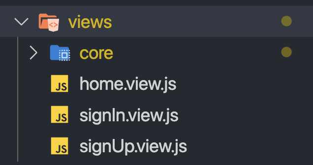
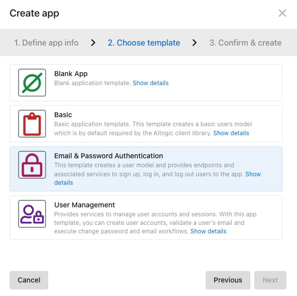
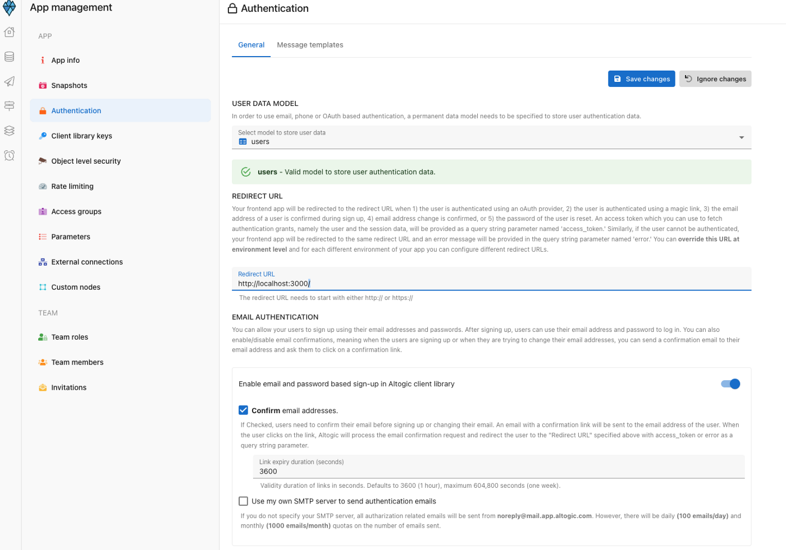

# How to Authenticate Email and Password Using React Native & Altogic

Hello, in this article, I will tell you how to build email/password based authentication flow using React Native and Altogic, a Backend-as-a-Service platform using its client library.

## Creating Project

Firstly, I have created React Native project, three views home, sign in, and sign up.



Then I have installed React Navigation library, and I have created the Altogic app. When I have entered the project name, I have chosen Email & Password Authentication templated. 
This template provides basic user management functionality. It creates a users model to store users' name, email, password, profile picture, sign-up, and last login date information and provides the following endpoints:

- Sign up new user - Using the provided user input data creates a new user in the database and returns the newly created user information and a session token.

- Log in to the account - Using the input email and password, checks the authentication credentials. If the user is authenticated, create a new session and return the session token and logged-in user information.

- Log out from account - Requires a valid session token in the request's 'Session' header and kills the associated user session. The session token becomes obsolete and cannot be used in future request calls.

- Get all user sessions - Requires a valid session token in the request's 'Session' header and returns all active sessions associated with the user.

- Update profile photo - Requires a valid session token in the request's 'Session' header and a profile picture file. Uploads the file to cloud storage and sets user's profile picture field value to the newly uploaded profile picture file URL

- Get user information - Requires a valid session token in the request's 'Session' header and returns the user information associated with the session token.



## Storing Session

I have installed the altogic client in react native project and set up a context API to keep session information and access all components. 

I have downloaded the AsyncStorage library to save the information held by the context API to the storage. Then I have created a Storage class that wrapped AsyncStorage in order to keep the keys together and prevent doing JSON parse operations every time.

```javascript
import AsyncStorage from "@react-native-async-storage/async-storage"

class Storage {
  constructor() {
    this.KEY_AUTH = "@auth"
  }

  set = async (key, value) => {
    try {
      const jsonValue = JSON.stringify(value)
      await AsyncStorage.setItem(key, jsonValue)
    } catch (e) {}
  }

  get = async (key) => {
    try {
      const jsonValue = await AsyncStorage.getItem(key)
      return jsonValue != null ? JSON.parse(jsonValue) : null
    } catch (e) {}
  }

  remove = async (key) => {
    await AsyncStorage.removeItem(key)
  }
}

export default new Storage()
```

## Auth Context
I have created auth.context.js after creating the storage class, and I have made a connection with the storage class to save this information. With the help of the useFetch hook, I could fetch the initial value in useState asynchronously.

The main context component is the provider. It fetches data from storage and writes the state. If the value is changed by setState, useEffect is triggered, and it is written to the state.

```javascript
import React, { useState, useEffect, useContext } from "react"
import storage from "../configs/storage"

const Context = React.createContext(null)

const useFetch = () => {
  const [auth, setAuth] = useState(null)
  const [isAuthLoading, setIsAuthLoading] = useState(true)

  useEffect(() => {
    storage.get(storage.KEY_AUTH).then((authFromStorage) => {
      setAuth(authFromStorage)
      setIsAuthLoading(false)
    })
  }, [])

  return [auth, isAuthLoading, setIsAuthLoading]
}

const Provider = ({ children }) => {
  const [fetchedAuth, isAuthLoading, setIsAuthLoading] = useFetch()
  const [auth, setAuth] = useState(fetchedAuth)

  useEffect(() => {
    setAuth(fetchedAuth)
  }, [fetchedAuth])

  useEffect(() => {
    storage.set(storage.KEY_AUTH, auth)
  }, [auth])

  return (
    <Context.Provider
      value={[auth, setAuth, isAuthLoading, setIsAuthLoading]}
    >
      {children}
    </Context.Provider>
  )
}

export const useAuthContext = () => {
  const context = useContext(Context)
  return context
}

export default Provider
```

## Navigation Control
I have assigned a path to the views in order to return to the app with the link in the email confirmation. (Deep Linking) The home page takes optional tokens as a parameter. If you come to this page with the token parameter, the application is accessed without password with the help of altogic’s getAuthGrant function.

- Note: You need to set deep link to create link for views. https://reactnavigation.org/docs/deep-linking/

```javascript
import React from "react"
import { Text } from "react-native"
import { NavigationContainer } from "@react-navigation/native"
import { createNativeStackNavigator } from "@react-navigation/native-stack"
import SignUpView from "../signUp.view"
import SignInView from "../signIn.view"
import HomeView from "../home.view"
import { useAuthContext } from "../../contexts/auth.context"
import _ from "lodash"
import helper from "../../utils/helper"
import AuthView from "./auth.view"

const Stack = createNativeStackNavigator()

const config = {
  screens: {
    Home: "home/:token?",
    SignIn: "sign-in",
    SignUp: "sign-up"
  }
}

const linking = {
  prefixes: ["myapp://"],
  config
}

function NavgiationView(navParam) {
  return (
    <NavigationContainer
      linking={linking}
      fallback={<Text>Loading...</Text>}
    >
      <Stack.Navigator>
        <Stack.Screen name="Home">
          {(props) => (
            <AuthView {...props}>
              <HomeView {...props} />
            </AuthView>
          )}
        </Stack.Screen>
        <Stack.Screen name="SignIn" component={SignInView} />
        <Stack.Screen name="SignUp" component={SignUpView} />
      </Stack.Navigator>
    </NavigationContainer>
  )
}

export default NavgiationView

```

## Auth Control Component
I wrapped the components that require signing in to control the auth operations with the AuthView component. This component takes two tokens, authToken and paramToken. authToken checks if storage has tokens. paramToken, on the other hand, checks whether a token has come from outside with a parameter.

The component looks at the authToken first, if the auth token is empty, it looks at the paramToken. If ParamToken exists, it will sign in with getAuthGrant. If neither token is available, it will redirect the user to the sign in view.

```javascript
import _ from "lodash"
import React, { useEffect, useState } from "react"
import { View, Text } from "react-native"
import { useAuthContext } from "../../contexts/auth.context"
import altogic from "../../configs/altogic"

function AuthView({ children, route, navigation }) {
  const [auth, setAuth, isAuthLoading] = useAuthContext()
  const authToken = _.get(auth, "token")
  const paramToken = _.get(route, "params.token")

  const [isLoading, setLoading] = useState(true)

  useEffect(() => {
    if (!_.isNil(paramToken) && _.isNil(authToken)) {
      handleToken()
    } else {
      setLoading(false)
    }
  }, [])

  useEffect(() => {
    if (_.isNil(paramToken) && !isAuthLoading && _.isNil(authToken)) {
      navigation.navigate("SignIn")
    }
  }, [isAuthLoading, authToken])

  const handleToken = async () => {
    setLoading(true)
    const { user, session } = await altogic.auth.getAuthGrant(
      paramToken
    )

    if (!_.isNil(session) && !_.isNil(user)) {
      setAuth({
        ...user,
        token: session.token
      })
    }
    setLoading(false)
  }

  return (
    <View>
      {isLoading || isAuthLoading ? (
        <Text>Loading...</Text>
      ) : authToken ? (
        children
      ) : (
        <Text>
          You do not have permission to access this page. Please login
        </Text>
      )}
    </View>
  )
}

export default AuthView
```

## Email Confirmation
For email confirmation, you must enter the url firstly to redirect in altogic. I have written a localhost and created a react web project in my local. The url redirected from the mail takes access_token, status and action as parameters.



I have added the token that I captured in the React web project as a link to the app.

```javascript
import './App.css';
import { useSearchParams, useNavigate } from "react-router-dom";

function App({props}) {
  const [params] = useSearchParams();
  const token = params.get("access_token")

  return (
    <div className="App">
      <header className="App-header">
        <h1>Email is confirmed.</h1>
        <a href={`myapp://home?token=${token}`} _blank>
          Back to app
        </a>
      </header>
    </div>
  );
}

export default App;
```

## Sign Up & Sign In
altogic.auth.signupWithEmail function requires two parameters: email, and password. Three responses are returned as user, session, and error. User contains id, providerUserId, provider, signUpAt, lastLoginAt, emailVerified, and phoneVerified. The session contains userId, token, creationDtm, accessGroupKeys, and userAgent information. If there is user and session information in the response from altogic in the signUp function, this information is saved to the storage with context auth, and the user is directed to the home page.

```javascript
import React, { useState } from "react"
import { Input, Icon, Stack, Box, Button } from "native-base"
import altogic from "../configs/altogic"
import _ from "lodash"
import { useAuthContext } from "../contexts/auth.context"
import helper from "../utils/helper"

function SignUpView({ navigation }) {
  const [auth, setAuth] = useAuthContext()

  const [show, setShow] = useState(false)

  const [inpEmail, setInpEmail] = useState("")
  const [inpPassword, setInpPassword] = useState("")

  const signUp = async () => {
    const { user, session, errors } =
      await altogic.auth.signUpWithEmail(inpEmail, inpPassword)

    if (!_.isNil(session) && !_.isNil(user)) {
      setAuth({
        ...user,
        token: session.token
      })
      navigation.navigate("Home")
    }
  }

  return (
    <Stack space={4} w="100%" alignItems="center">
      <Input
        w={{
          base: "75%",
          md: "25%"
        }}
        InputLeftElement={
          <Icon
            ios="ios-menu"
            android="md-menu"
            style={{ fontSize: 20, color: "red" }}
          />
        }
        placeholder="E-Mail"
        onChangeText={setInpEmail}
      />
      <Input
        w={{
          base: "75%",
          md: "25%"
        }}
        type={show ? "text" : "password"}
        InputRightElement={
          <Icon
            size={5}
            mr="2"
            color="muted.400"
            onPress={() => setShow(!show)}
          />
        }
        placeholder="Password"
        onChangeText={setInpPassword}
      />
      <Box alignItems="center">
        <Button onPress={signUp}>Sign Up</Button>
      </Box>
    </Stack>
  )
}

export default SignUpView
```

The signIn function works very similarly to signUp. It generates a token and wants you to store it.

```javascript
import React, { useState } from "react"
import { Input, Icon, Stack, Box, Button } from "native-base"
import altogic from "../configs/altogic"
import helper from "../utils/helper"
import _ from "lodash"
import { useAuthContext } from "../contexts/auth.context"

function SignInView({ navigation }) {
  const [auth, setAuth] = useAuthContext()

  const [show, setShow] = useState(false)

  const [inpEmail, setInpEmail] = useState("")
  const [inpPassword, setInpPassword] = useState("")

  const goSignUp = async () => {
    navigation.navigate("SignUp")
  }

  const signIn = async () => {
    const { user, session, errors } =
      await altogic.auth.signInWithEmail(inpEmail, inpPassword)

    if (!_.isNil(session) && !_.isNil(user)) {
      setAuth({
        ...user,
        token: session.token
      })
      navigation.navigate("Home")
    }
  }

  return (
    <Stack space={4} w="100%" alignItems="center">
      <Input
        w={{
          base: "75%",
          md: "25%"
        }}
        InputLeftElement={
          <Icon
            ios="ios-menu"
            android="md-menu"
            style={{ fontSize: 20, color: "red" }}
          />
        }
        placeholder="E-Mail"
        onChangeText={setInpEmail}
      />
      <Input
        w={{
          base: "75%",
          md: "25%"
        }}
        type={show ? "text" : "password"}
        InputRightElement={
          <Icon
            size={5}
            mr="2"
            color="muted.400"
            onPress={() => setShow(!show)}
          />
        }
        placeholder="Password"
        onChangeText={setInpPassword}
      />
      <Box alignItems="center">
        <Button onPress={signIn}>Sign In</Button>
        <Button onPress={goSignUp}>Sign Up</Button>
      </Box>
    </Stack>
  )
}

export default SignInView

```

## Sign Out

altogic.auth.signOut function should be used to terminate the session. This function takes a token as a parameter and terminates the session. After the session in Altogic is terminated, the auth information in the storage is deleted, and the user is directed to the SignIn page.

```javascript
import React from "react"
import { View, Text } from "react-native"
import { Box, Button } from "native-base"
import altogic from "../configs/altogic"
import storage from "../configs/storage"
import _ from "lodash"
import { useAuthContext } from "../contexts/auth.context"

function HomeView({ navigation }) {
  const [auth, setAuth] = useAuthContext()

  const signOut = async () => {
    if (!_.isNil(auth) && !_.isNil(auth.token)) {
      await altogic.auth.signOut(auth.token)
      setAuth(null)
      navigation.navigate("SignIn")
    }
  }

  return (
    <View>
      <Text>Hello {auth.email}!</Text>
      <Box alignItems="center">
        <Button onPress={signOut}>Sign Out!</Button>
      </Box>
    </View>
  )
}

export default HomeView

```
